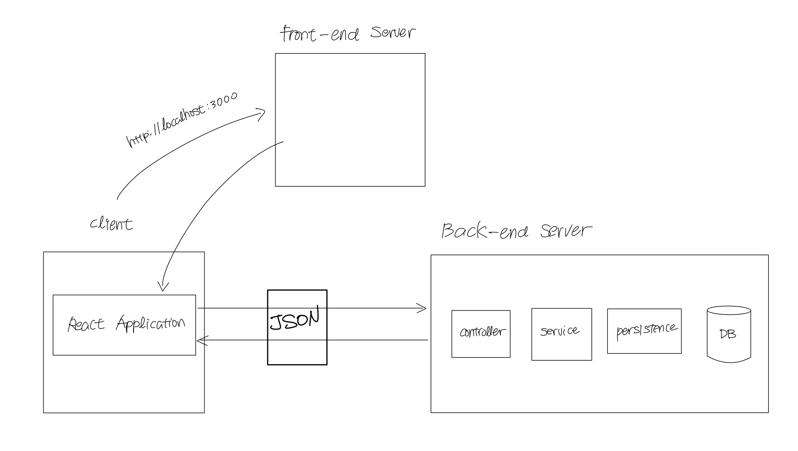

# 𝘾𝙍𝙐𝘿 𝘽𝙤𝙖𝙧𝙙 📌

React와 spring boot를 사용한 CRUD 게시판 웹 애플리케이션

> ### references 🔗   
> React.js, 스프링부트, AWS로 배우는 웹 개발 101

## Contents		
* ### [기능](https://github.com/mingeun2154/project/tree/main/CRUDBoard#services)      
* ### [프론트엔드 서버](https://github.com/mingeun2154/project/tree/main/CRUDBoard#front-end-server)
* ### [백엔드 서버](https://github.com/mingeun2154/project/tree/main/CRUDBoard#back-end-server)

#    

## Services
* 계정 생성
* 로그인
* Create : 게시글 생성
* Read : 게시글 조회
* Update : 게시글 수정
* Delete : 게시글 삭제

## Front-end Server
프론트엔드 서버의 기능은 한 가지이다. client가 도메인에 접속하면 **리액트 애플리케이션**을 반환하는 것이다.

이후 리액트 애플리케이션이 클라이언트측에서 렌더링도 하고 백엔드 서버와 통신한다.

## Back-end Server
백엔드 서버는 아래와 같은 계층적 구조를 가진다.

* controller : 요청에 맞는 서비스 로직을 실행한다.
* service : 서비스 로직을 추상화 한 클래스. 컨트롤러가 사용한다.
* persistence : DB에 직접 접근하는 클래스. service가 전달한 model을 DB에 삽입하거나 삭제한다.
